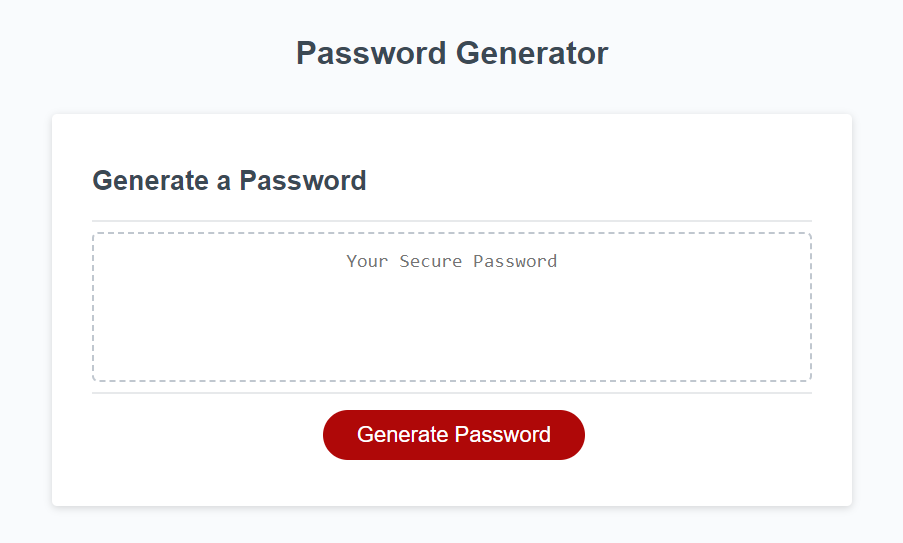
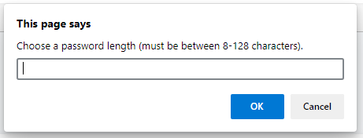
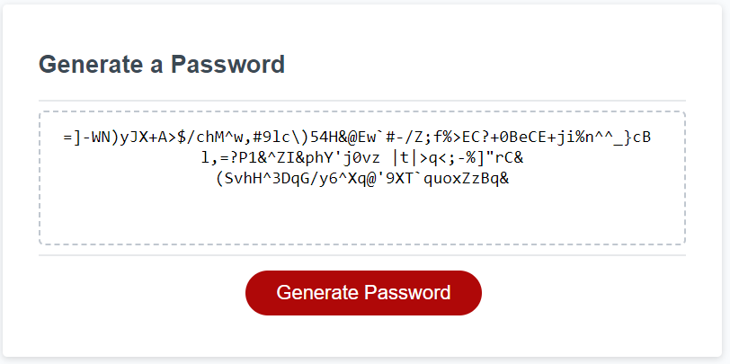

# challenge-3-password-generator
Randomly generates strong user passwords
# challenge-2-professional-portfolio
Repository containing a simple HTML page that uses JavaScript to produce a random, unique password based on parameters set by a user through a series of alert pop-ups. 

## User Story
AS AN employee with access to sensitive data  
I WANT to randomly generate a password that meets certain criteria  
SO THAT I can create a strong password that provides greater security  

## Acceptance Criteria
GIVEN I need a new, secure password  
WHEN I click the button to generate a password  
THEN I am presented with a series of prompts for password criteria  
WHEN prompted for password criteria  
THEN I select which criteria to include in the password  
WHEN prompted for the length of the password  
THEN I choose a length of at least 8 characters and no more than 128 characters  
WHEN asked for character types to include in the password  
THEN I confirm whether or not to include lowercase, uppercase, numeric, and/or special characters  
WHEN I answer each prompt  
THEN my input should be validated and at least one character type should be selected  
WHEN all prompts are answered  
THEN a password is generated that matches the selected criteria  
WHEN the password is generated  
THEN the password is either displayed in an alert or written to the page

## Description of Work Performed

To accompany the provided HTML and CSS files, wrote a JavaScript file that accomplishes the following:
* Upon clicking the "Generate Password" button, the user is prompted to input a password length
* Through a series of alerts, the user can select whether or not to include lowercase letters, uppercase letters, numbers, and/or special characters in the password output
* The user gets an error message when:
  * Selected password length is less than 8 characters
  * Selected password length is greater than 128 characters
  * No character types have been selected to be included in the password
* A random, unique password is created based on user-selected parameters
* The password is displayed in the text field box 

## Link to deployed GitHub page
[Deployed Challenge 3 Password Generator Repo](https://github.com/abmetheny/challenge-3-password-generator)

## Screenshots

## License

This project is licensed under the MIT License - see the LICENSE.md file for details.